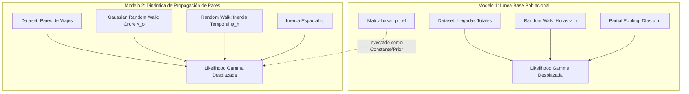

# Plan: Modelo Bayesiano Jerárquico de Headways (H8 · Anada)

## Objetivo

Estimar el headway esperado y su variabilidad por **parada**, **franja horaria** y **día de la semana** (Modelo 1), para posteriormente modelar la **propagación** y el acoplamiento dinámico del retraso entre buses emparejados a lo largo del **trayecto** (espacial) y del **día** (temporal) (Modelo 2).

### Fuentes de datos

| Fuente | Ruta | Rol |
|--------|------|-----|
| Pares | `processed/headways/headways_pares3_H8_Anada_*.csv` | **Fuente principal:** headway delante $\rightarrow$ detrás por parada (Modelo 1 y 2) |
| Llegadas | `processed/eventos/arrivals_*_limpio_3.csv` | Solo con `--source arrivals` (gap cronológico; puede mezclar buses no emparejados) |

* **Sentido inicial:** Anada. Tornada en fase posterior (modelo separado).
* **Distribución de observación:** **Gamma Desplazada** ($y > 0.16$ min) en toda la cadena. La estructura predictiva se construye en **escala log** y se transforma a media en minutos vía $\exp(\cdot)$. No se usan likelihoods Normal ni LogNormal.

---

## 1. Definición de franjas horarias y suavizado temporal

Las franjas se definen por la **hora de paso** (`hora_paso` en llegadas; `hora_delante_str` o `franja_hora` en pares).

| Código | Franja | Intervalo |
|--------|--------|-----------|
| 0 | Madrugada | 00:00 – 06:59 |
| 1–15 | Bloques Horarios | 07:00 – 21:59 (Bines estrictos de 1 hora, ej: 1 = 07–08h) |
| 16 | Noche | 22:00 – 23:59 |

> **Mitigación del efecto escalón:** Aunque los datos se agrupan en bines indexados ($h$), los parámetros asociados ($v_h$ y $\psi_h$) no se modelan con *priors* independientes. Se utiliza un **Random Walk temporal (AR1)** que fuerza matemáticamente que la transición entre las 08:59 y las 09:01 sea suave y continua, eliminando saltos artificiales en las fronteras de las franjas.

---

## 2. Día de la semana

Extraer de la fecha del archivo (`arrivals_2026-06-02` $\rightarrow$ **martes**).

| Código | Día |
|--------|-----|
| 0 | Lunes |
| 1 | Martes |
| 2 | Miércoles |
| 3 | Jueves |
| 4 | Viernes |
| 5 | Sábado |
| 6 | Domingo |

Con ~48 días de histórico hay **6–7 repeticiones por weekday**. Se aplica **partial pooling** (efectos jerárquicos) para regularizar los días con menor muestreo o alta variabilidad, evitando efectos fijos sin regularizar.

---

## 3. Arquitectura del sistema (Dos Modelos Desacoplados)

Para evitar el doble conteo de información (*data leakage*) y asegurar gradientes estables (sin `clip` en el soporte), el problema se divide en dos etapas secuenciales independientes:



---
## 4. Modelo 1 — Headway de referencia (Solo Llegadas)

### Observación y Corrección de Soporte
Para permitir aproximaciones extremas de *bus bunching* (hasta 10 segundos $\approx 0.16$ minutos) sin alcanzar el límite no definido de cero en la distribución Gamma, se aplica un desplazamiento de seguridad del soporte:

$$y_{\text{shifted}} = y_{\text{obs}} - 0.16$$

### Estructura del Modelo (Escala Log)

$$\log \mu_{\text{ref}}[s, h, d] = \mu_0 + u_d[d] + v_h[h] + w_s[s]$$

* **Día ($u_d$):** $u_d[d] \sim \text{Normal}(0, \sigma_{\text{día}})$
* **Hora ($v_h$):** $v_h[h] \sim \text{Normal}(v_h[h-1], \sigma_{\text{hora}})$ (Random Walk temporal)
* **Parada ($w_s$):** $w_s[s] \sim \text{Normal}(0, \sigma_{\text{parada}})$

### Likelihood (Reloj Estático — implementado en Stan)

$$\mu_i = \exp(\alpha + a_{s[i]} + b_{h[i]} + c_{d[i]})$$

$$y_{\text{shifted}} \sim \text{Gamma}(\kappa,\; \kappa / \mu_i)$$

con $\kappa$ global (dispersión constante). Implementación: `bayesian/R/stan/model1_static.stan`.

> **Filtros de calidad:** Headway en el intervalo de 1 a 30 minutos. Excluir pasos con `ordre_faltantes` en el paso actual o anterior. Parámetro `sentit == Anada` estricto.

---

## 5. Modelo 2 — Dinámica y Evolución del Par (Solo Pares)

Este modelo hereda la matriz de expectativas basales $\mu_{\text{ref}}[s, h, d]$ calculada y fijada por el **Modelo 1**. 

### Definición de Anomalías Logarítmicas
Se eliminan los `clips` numéricos planos que rompen los gradientes de NUTS. Las anomalías se calculan directamente en el espacio continuo:

$$\text{log\_anom\_esp} = \log(y_{\text{lag\_esp}} - 0.16) - \log \mu_{\text{ref}}[s-1, h, d]$$

$$\text{log\_anom\_temp} = \log(y_{\text{lag\_temp}} - 0.16) - \log \mu_{\text{ref}}[s, h, d]$$

### Ecuación Estructural Dinámica

$$\log \mu_{\text{pair}} = \log \mu_{\text{ref}}[s, h, d] + \gamma[o] + \phi \cdot \text{log\_anom\_esp} + I_{\text{temporal}} \cdot \psi[h] \cdot \text{log\_anom\_temp} + \varepsilon_{\text{par}}[\text{par\_id}]$$

* **Deriva de Línea ($\gamma[o]$):** Se modela como un **Gaussian Random Walk ordinal** sobre las paradas para asegurar un perfil suave a lo largo del trayecto: $\gamma[o] \sim \text{Normal}(\gamma[o-1], \tau_{\gamma})$. Reemplaza al GP 1D para reducir el coste computacional de $O(N^3)$ a $O(N)$.
* **Inercia Espacial ($\phi$):** $\phi \sim \text{TruncatedNormal}(0.2, 0.1, 0, 1)$
* **Inercia Temporal ($\psi[h]$):** Sensibilidad de acoplamiento al par precedente modelada como un **Random Walk sobre $h$** para evaluar transiciones suaves entre horas punta y valles.
* **Efecto de Par ($\varepsilon_{\text{par}}$):** $\varepsilon_{\text{par}}[\text{par\_id}] \sim \text{Normal}(0, \sigma_{\text{par}})$.

### Likelihood del Par

$$y_{\text{pair\_shifted}} = y_{\text{pair}} - 0.16$$

$$y_{\text{pair\_shifted}} \sim \text{Gamma}(\mu = \exp(\log \mu_{\text{pair}}), \sigma = \sigma_{\text{pair}}[s, h])$$

---

## 6. Escalamiento por fases (M0 a M4)

Al independizar los modelos, el escalamiento se vuelve completamente modular:

| Modelo | Componentes Incluidos | Propósito Operativo |
|--------|-----------------------|---------------------|
| **M0** | Solo llegadas, $\alpha[s, h]$ con horas independientes. | Baseline poblacional sin estructura temporal continua. |
| **M1** | M0 + Efecto día semana $u_d$ + **Random Walk en franjas horarias $v_h$**. | **Modelo 1 Final:** Matriz $\mu_{\text{ref}}$ estabilizada y suave. |
| **M2** | Inyección de $\mu_{\text{ref}}$ (M1) + Pares con $\phi$ espacial y $\gamma[o]$ (Random Walk). | Propagación y deriva en el trayecto físico. |
| **M3** | M2 + Inercia temporal $\psi[h]$ estructurada como Random Walk horaria. | Acoplamiento dinámico a lo largo de la jornada. |
| **M4** | M3 + Efecto aleatorio por par de viajes $\varepsilon_{\text{par}}$. | **Modelo 2 Final:** Captura heterogeneidad por viaje. |

---

## 7. Priors Sugeridos (Escala Logarítmica)

| Parámetro | Prior | Rol y Significado |
|-----------|-------|-------------------|
| $\mu_0$ | $\text{Normal}(2.0, 0.4)$ | Log-media global base ($\approx 7.3$ min) |
| $\sigma_{\text{día}}$ | $\text{HalfNormal}(0.15)$ | Variación del headway entre días de la semana |
| $\sigma_{\text{hora}}$ | $\text{HalfNormal}(0.2)$ | Desviación del paso del Random Walk temporal |
| $\sigma_{\text{parada}}$ | $\text{HalfNormal}(0.3)$ | Variación estructural entre ubicaciones físicas |
| $\phi$ | $\text{TruncatedNormal}(0.2, 0.1, 0, 1)$ | Coeficiente de inercia elástica espacial |
| $\psi[h]$ | $\text{RandomWalk}(\sigma=0.05, \text{bounds}=[0, 1])$ | Evolución horaria de la inercia temporal |
| $\tau_{\gamma}$ | $\text{HalfNormal}(0.08)$ | Magnitud del paso en la deriva de la línea (`ordre`) |
| $\beta_0$ | $\text{Normal}(-1.0, 0.3)$ | Dispersión base de la forma Gamma |

---

## 8. Limitaciones Controladas y Mitigaciones

| Problema Identificado | Estrategia de Mitigación en el Diseño |
|-----------------------|---------------------------------------|
| **Divergencias por clips** | Se elimina por completo el uso de `clip()`. El soporte se desplaza rígidamente ($y - 0.16$) asegurando gradientes continuos y limpios para NUTS. |
| **Data Leakage (Doble Conteo)** | Desacoplamiento en dos modelos. El Modelo 1 fija la población de referencia; el Modelo 2 modela las desviaciones dinámicas de los pares. |
| **Complejidad del GP 1D** | Sustitución por un *Gaussian Random Walk* sobre el índice ordinal de la parada (`ordre`), bajando el coste a $O(N)$. |
| **Efecto Escalón Horario** | Parametrización de los bines de horas mediante procesos autoregresivos (Random Walk) para suavizar fronteras temporales. |

---

## 9. Implementación (R + Stan)

### Scripts

| Script | Rol |
|--------|-----|
| `prepare_bayes_data.py` | Python — CSVs `headways_stop.csv`, `headways_pair.csv`, `maps.json` |
| `R/fit_model1.R` | Ajuste Modelo 1 con **rstan** |
| `R/stan/model1_static.stan` | Especificación Stan (Reloj Estático) |
| `R/plot_model1.R` | Diagnósticos básicos (hiperparámetros, RW horario) |

Modelo 2 (M2–M4, propagación dinámica) pendiente de implementar en Stan.

### Flujo recomendado

```bash
cd bayesian

# 1. Preparar datos (--source pairs por defecto)
python prepare_bayes_data.py --stop-only

# 1b. Prueba con un día
python prepare_bayes_data.py --date 2026-06-06 --stop-only

# 2. Ajustar en R
cd R
Rscript fit_model1.R --data ../data/2026-06-06 --iter 400 --warmup 200
Rscript fit_model1.R --data ../data --chains 4 --iter 1600 --warmup 800

# 3. Gráficos
Rscript plot_model1.R --fit output/2026-06-06/fit_model1.rds
```

### Artefactos generados

```
bayesian/
├── data/
│   ├── headways_stop.csv
│   ├── headways_pair.csv    # para Modelo 2 (futuro)
│   └── maps.json
└── R/
    ├── stan/model1_static.stan
    └── output/<dataset>/
        ├── fit_model1.rds
        ├── summary_model1.csv
        └── mu_ref.csv
```

---

## Referencias en el repositorio

| Archivo | Contenido |
|---------|-----------|
| `bayesian/R/README.md` | Comandos y especificación del Modelo 1 en R |
| `bayesian/prepare_bayes_data.py` | Preparación de datos desde `processed/` |
| `bayesian/config.py` | Constantes compartidas (`Y_SHIFT`, franjas) |
| `plot_hours.py` | Cálculo de headways clásicos y pares |
| `processed/eventos/` | Histórico de llegadas (48 días limpios) |
| `processed/headways/` | Histórico de pares detectados (48 días limpios) |